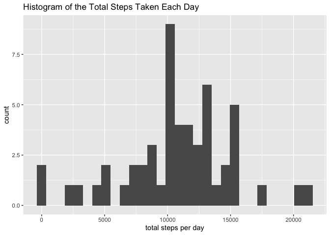
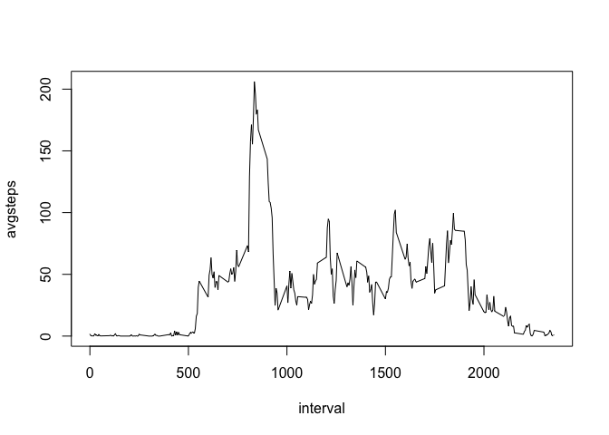
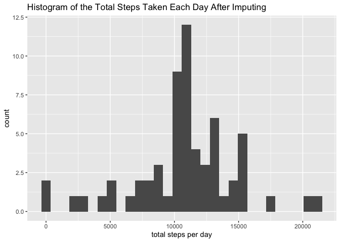
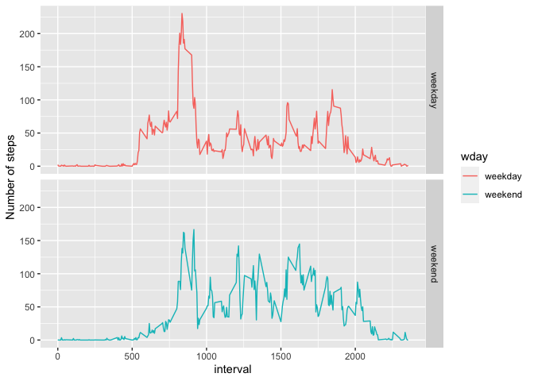

## Loading and preprocessing the data


```r
unzip("activity.zip")
activity <- read.csv("activity.csv", stringsAsFactors = FALSE, na.strings = "NA")
activity$date <- as.Date(activity$date, "%Y-%m-%d")
```

## What is mean total number of steps taken per day?


```r
stepsperday <- summarise(group_by(activity, date), totalsteps = sum(steps))
qplot(totalsteps, data = stepsperday, xlab = "total steps per day", ylab = "count", main = "Histogram of the Total Steps Taken Each Day")
```

<!-- -->

```r
meansteps = mean(stepsperday$totalsteps, na.rm = TRUE)
mediansteps = median(stepsperday$totalsteps, na.rm = TRUE)
```

The mean total number of steps taken per day is 1.0766189\times 10^{4}. 
The median total number of steps taken per day is 10765.

## What is the average daily activity pattern?


```r
intervalsteps <- summarise(group_by(activity, interval), avgsteps = mean(steps, na.rm = TRUE))
with(intervalsteps, plot(interval, avgsteps, type = 'l'))
```

<!-- -->

```r
max <- intervalsteps$interval[which.max(intervalsteps$avgsteps)]
```

Interval 835, on average across all the days in the dataset, contains the maximum number of steps.

## Imputing missing values


```r
nummissing <- sum(is.na(activity$steps))
```

There are 2304 missing values in the dataset.

We will impute the missing values by using the mean for that 5-minute interval.


```r
intervalsteps2 <- intervalsteps$avgsteps
names(intervalsteps2) <- intervalsteps$interval
complete <- activity[complete.cases(activity),]
incomplete <- activity[!complete.cases(activity),]
incomplete$steps <- intervalsteps2[as.character(incomplete$interval)]
newdata <- rbind(complete, incomplete)
```


```r
newstepsperday <- summarise(group_by(newdata, date), totalsteps = sum(steps))
qplot(totalsteps, data = newstepsperday, xlab = "total steps per day", ylab = "count", main = "Histogram of the Total Steps Taken Each Day After Imputing")
```

<!-- -->

```r
newmeansteps = mean(newstepsperday$totalsteps, na.rm = TRUE)
newmediansteps = median(newstepsperday$totalsteps, na.rm = TRUE)
```

The mean total number of steps taken per day after imputing is 1.0766189\times 10^{4}.
The median total number of steps taken per day after imputing is 1.0766189\times 10^{4}.

The mean and median total number of steps taken per day after imputing missing data do not differ significantly from the first part of the assignment.

Imputing the missing data did however increase the count in the histogram for the 13125-16250 bin such that it is now the bin with the highest count.

## Are there differences in activity patterns between weekdays and weekends?


```r
weekends <- c("Saturday", "Sunday")
newdata$wday <- factor((weekdays(newdata$date) %in% weekends), levels = c(FALSE, TRUE), labels = c("weekday", "weekend"))
intervalsteps3 <- summarise(group_by(newdata, interval, wday), avgsteps = mean(steps, na.rm = TRUE))
g <- ggplot(intervalsteps3, aes(interval, avgsteps, color = wday))
g + geom_line() + facet_grid(wday~.) + labs(y = "Number of steps")
```

<!-- -->
